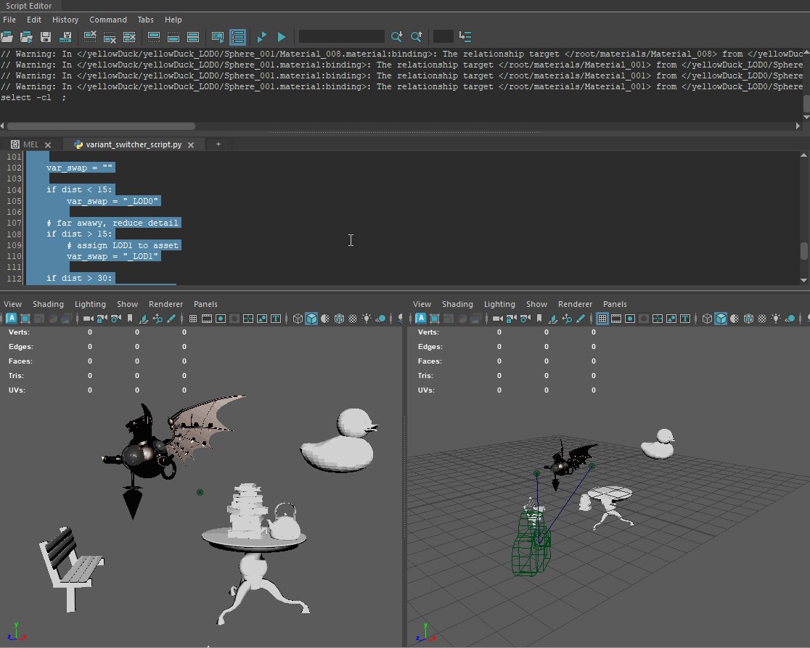

# Maya USD Camera-based LOD Variant Switcher

Personal Project began over Winter 2026 in Autodesk Maya with Python USD API.
This project was inspired from my CIS 7000 Production Pipelines professor Rebecca Hallac and my TD friend Julia DeLaney.

## Demo

Distance Based

### Distance Based

The LOD is determined by the object's distance from camera. Distance thresholds: < 15cm = LOD0, > 15cm = LOD1, > 30cm = LOD2

### Screen Space Coverage

The LOD value is determined by projecting the world coordinates back into screen space and calculating what percentage the screen space bounding box occupies.
The baseline is set to the following thresholds: >10% = LOD0, 1-10% = LOD1, 0.1-1% = LOD2

### Frustum Culling

Objects not visible to camera are set to the lowest resolution.

## Setup / Usage

The logic for the tool is in variant_switcher_script.py. It can be run in the script editor or added to the shelf as a button.

